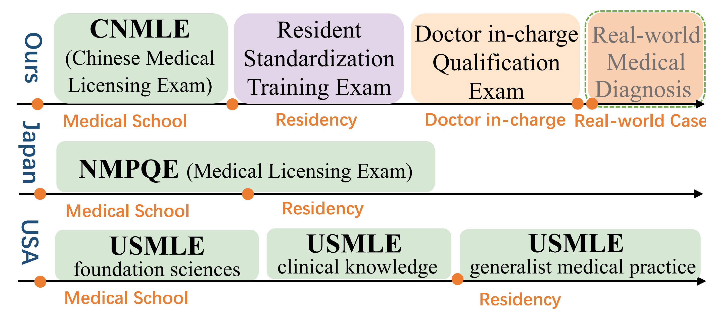
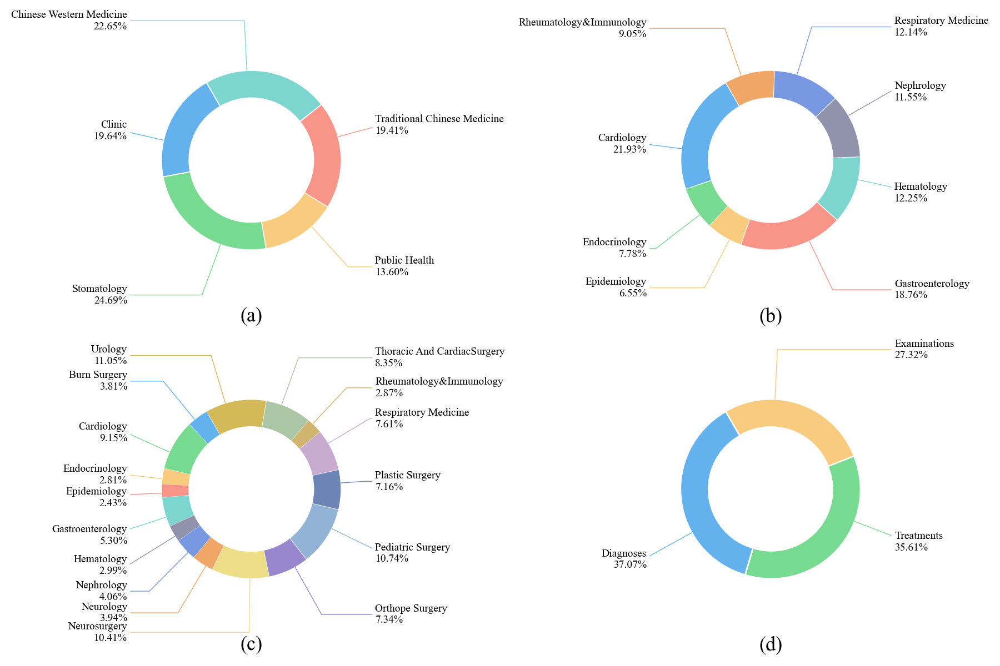
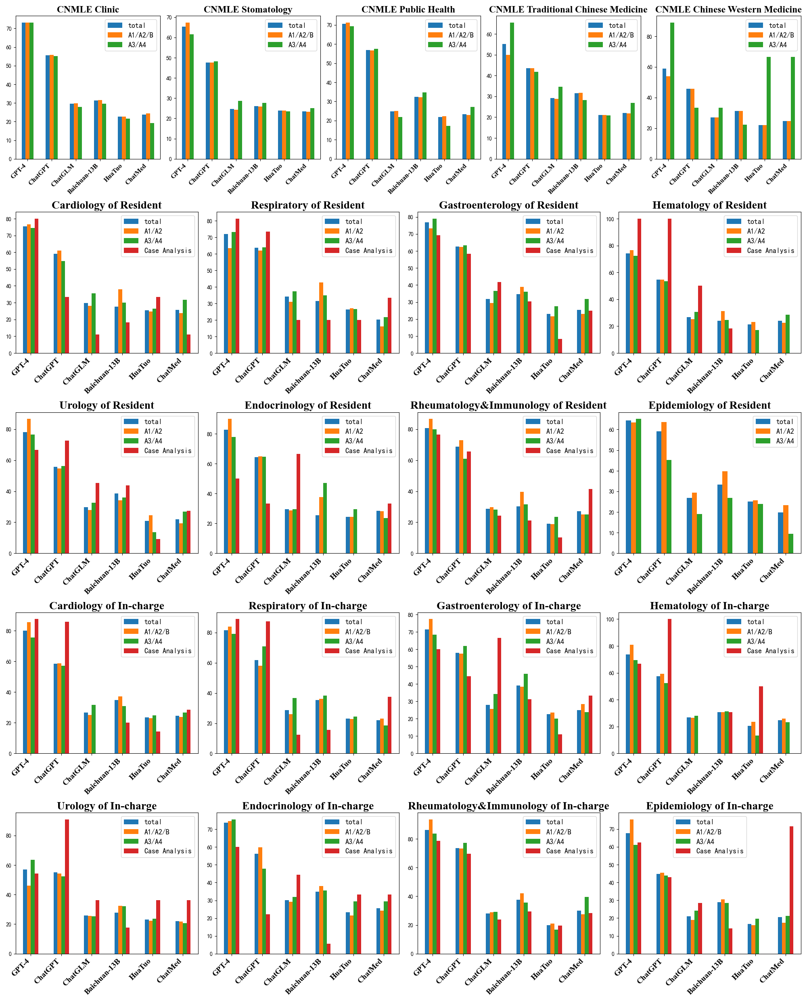

# MedBench
___
We have proposed a new evaluation benchmark for Chinese medical language models called MedBench. It possesses the following characteristics: (1) Authenticity and Novelty. It exclusively utilizes expert-annotated electronic health records (EHRs) and up-to-date medical examinations to minimize contamination. (2) Comprehensiveness and Multi-facetedness. It is meticulously designed to align with Chinese medical standards and practices by incorporating three-stage multi-disciplinary examinations and real-world clinical cases. (3) Practicality. Human evaluation on actual clinical cases ensures consistency with the practical realities of medicine, while difficulty-stratified divisions in MedBench allow for rapid assessment.

[MedBench: A Large-Scale Chinese Benchmark for Evaluating Medical Large Language Models](https://arxiv.org/abs/2312.12806)

## Overview
___
For better evaluating medical foundation models, this paper proposes MedBench as a large benchmark with 40,041 exercises originating from both authentic medical examinations and real-world diagnostic and treatment cases. Specifically, we collect three-stage medical examinations that serve as a faithful reflection of the comprehensive process involved in obtaining medical licenses in mainland China, exemplifying essential medical knowledge. Moreover, we construct a number of real-world cases based on electronic health records that provide examination plans, diagnoses, and treatments based on patients’ symptoms, which can reveal the medical knowledge utilization and reasoning capabilities of LLMs in the real world.

## Result
___

